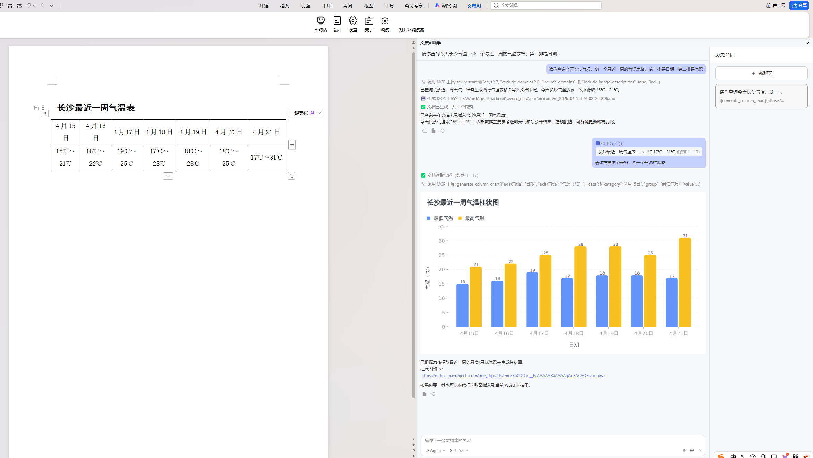

# Word Agent


<p align="center">
  <a href="backend/pyproject.toml"></a>
  <a href="backend/README.md"></a>
  <a href="https://www.langchain.com/"></a>
  <a href="https://www.langchain.com/langgraph"></a>
  <a href="frontend/microsoft_word_plugin/package.json"></a>
  <a href="README.md"></a>
  <a href="LICENSE"></a>
</p>

<p align="center">
  <a href="README.md">English</a> | <a href="README.zh-CN.md">中文文档</a>
</p>

## 1. Overview

This project is an AI-assisted writing system based on single-agent and multi-agent workflows: **WenCe AI (Word Agent)**. After users install the add-in in office suites (such as WPS and Microsoft Word), they can interact with AI in natural language to get writing suggestions, content generation, and structure optimization.

> WenCe AI (Word Agent): strategy-driven writing, smarter expression.

The backend is built with FastAPI, and the frontend WPS add-in communicates with the backend through streaming APIs, so users can see LLM outputs in real time for a seamless writing-assistant experience.

The frontend is developed with Vue 3 and JavaScript. A key module is the DocxJson bidirectional converter, which transforms formatted Word document content and JSON structures into each other.

The backend is implemented in Python, using LangChain and LangGraph for agent design and collaboration, ChatOpenAI-compatible APIs for SSE streaming and tool invocation, and a lightweight PySide6 desktop panel for add-in installation and log viewing.

At its core, this project focuses on **structured Word document generation**. The project defines a JSON schema conceptually similar to HTML and CSS, abstracting paragraph and text-run styles to help agents understand and generate well-formatted documents.

Main JSON data structures:

- **paragraphs**: an array of Word paragraphs containing multiple runs; this is the primary editable object for the agent
  - **pStyle**: paragraph style ID (for example, Heading 1, Heading 2, Body)
  - **runs**: text-run array, the smallest content unit in this project
    - **text**: text content
    - **rStyle**: character style ID (for example, bold, red)
  - **paraIndex**: paragraph index so the agent can locate and edit a specific paragraph precisely
- **styles**: style definition dictionary containing all paragraph and character style definitions; the agent references these style IDs when generating content

Compared with common AI writing tools, WenCe AI provides:

1. **Cross-version and cross-platform compatibility**: built on mainstream office software with a Copilot-like add-in UX, lowering the adoption barrier for regular users, with support for both Windows and Linux.
2. **Native rich-text editing with style and paragraph awareness**: unlike many Word AI assistants, this project understands Word structure, can collect web information autonomously, and can modify both structure and content according to user requirements.
3. **Efficient editing with multi-agent collaboration**: multiple agents play different expert roles and collaborate to produce deeper long-form writing.
4. **Open and flexible integration**: users provide their own API keys and can choose from mainstream LLM providers and models.

## 2. Project Preview

| WPS Add-in UI | Backend Qt UI |
| -- | -- |
|  |  |

For example, in WPS single-agent mode, a user asks: "Expand my internship objective into five points." The agent first calls `search_document` to locate the target paragraph, then calls `read_document` to read it, analyzes the content, calls `delete_document` to remove the original text, and finally calls `generate_document` to produce the rewritten result. The frontend add-in renders before/after changes with different highlight colors so users can clearly see what the agent modified.


The generated article conforms to Word document structure and formatting. While generating text, the agent also returns style metadata (for example titles, body text, bold, fonts, indentation, and line spacing). The frontend uses these style definitions to render properly formatted Word content.

In addition, this project supports custom tool integration through MCP server configuration, allowing agents to call third-party APIs. Using **Tavily Search MCP** and a **Visualization Chart MCP Server** as an example: when a user asks for today's Changsha temperature and a one-week temperature table, the agent can call Tavily MCP to fetch weather data, then call `generate_document` to create table content and return it to the frontend for rendering. If the user then asks, "Based on this table, draw a temperature bar chart," the agent calls `read_document` to understand the table and then calls the chart MCP server to generate an image URL, which is rendered in the add-in chat panel.



## 3. Development Plan

- [x] Single-agent mode
- [x] Multi-agent mode
- [x] Remote MCP server integration
- [ ] Local MCP server and Skill tool integration
- [ ] Advanced style editing (tables, illustrations, equations, etc.)

#### Supported Office Suites

- WPS Office (Windows, Linux), version 12.1.25225 and above
- Microsoft Word (Windows, Web), version 2019/2021 and above

## 4. System Architecture

To better satisfy user needs and improve generation stability and depth, the project provides two agent architectures.

### 4.1 Single-Agent Loop Architecture

#### Architecture Diagram


The frontend WPS add-in converts user requests and selected paragraph ranges into structured JSON and sends them to the backend.

In the backend single-agent architecture, the system follows a standard ReAct loop. In each round, the agent reasons over the user input and current document state, chooses whether to call a tool (for example, web search) or end directly, then reasons again based on tool results and continues until completion.

- **read_document tool**: reads content within `(startPosition, endPosition)` and returns structured JSON to the agent.
- **generate_document tool**: generates structured JSON content and returns it to the frontend add-in.
- **search_document tool**: locates paragraphs by format or text criteria and returns positions to the agent.
- **web_fetch tool**: fetches information from websites provided by the user.

### 4.2 Multi-Agent Architecture

#### Architecture Diagram


The frontend flow is the same as in single-agent mode. In the backend multi-agent workflow, a **planner agent** orchestrates and schedules multiple specialized agents.

- **research agent**: collects external references
- **outline agent**: generates an article outline from references and requirements
- **writer agent**: writes content based on references and requirements
- **reviewer agent**: reviews generated content and provides revision suggestions

## 5. Quick Start

### Environment Setup

- Node v22.12.0
- wpsjs 2.2.3
- Python 3.11.14
- Windows 10/11 or Ubuntu 22.04

### Build Frontend Add-in

```bash
cd frontend/wps_word_plugin       # WPS Word add-in
cd frontend/microsoft_word_plugin # or Microsoft Word add-in
pnpm install
pnpm build
```

### Run Backend Service

```bash
cd backend
uv run python main.py
```

### Use LangSmith Tracing

The project also supports LangSmith for tracing and analyzing agent behavior. See [backend/README.md](backend/README.md) for configuration details.


### Package the Desktop App

```bash
cd backend/deploy
uv run pyinstaller wence.spec
```

The packaged executable is generated in `backend/deploy/dist`.

If you do not want to package it yourself, you can download prebuilt archives from Releases and run the executable directly.

### Download

Packaged release files: [Release](https://github.com/visresearch/WordAgent/releases).

### Run the App

After downloading, extract and run the executable. Start the backend service (`wence_word_plugin -> Install`), open Word, trust the add-in, and start using the system.

You need to configure an LLM API. This project is currently tested with Alibaba Bailian Qwen3.5-Plus APIs.

## 6. LLM API Compatibility

The project has tested part of the mainstream LLM APIs in China, and compatibility is still being expanded:

- [x] Qwen 3.5 Plus (stable)
- [x] Qwen3 Max (stable)
- [x] GLM-5 (stable)
- [x] GPT 5.4 (stable)
- [x] MiniMax M2.5 (stable)
- [x] Step 3.5 Flash (stable)
- [x] DeepSeek v3.2 (stable)
- [x] Claude Sonnet 4.6 (issues with document-generation tool calls)
- [x] Kimi K2.5 (can fall into tool-call loops)
- [ ] Gemini 3.1 Pro

Note: part of development used free quotas from [Alibaba Bailian](https://bailian.console.aliyun.com/) and [OpenRouter](https://openrouter.ai/models?q=free).

## 7. About the Author

Contact: https://cmcblog.netlify.app/about/

## 8. Open-Source License

This project is released under the Apache License 2.0.
