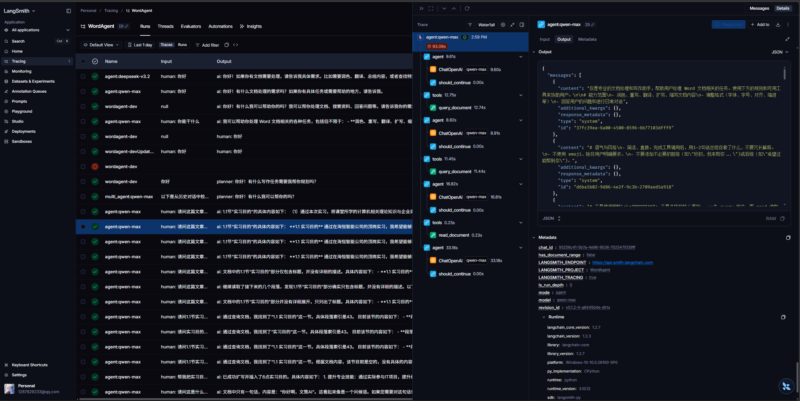

# Word Agent


<p align="center">
  <a href="backend/pyproject.toml"></a>
  <a href="backend/README.md"></a>
  <a href="https://www.langchain.com/"></a>
  <a href="https://www.langchain.com/langgraph"></a>
  <a href="frontend/microsoft_word_plugin/package.json"></a>
  <a href="README.md"></a>
  <a href="LICENSE"></a>
</p>

<p align="center">
  <a href="README.md">English</a> | <a href="README.zh-CN.md">中文文档</a>
</p>

## 1. Overview

Word Agent is an AI-assisted writing system (single-agent and multi-agent) for office suites such as WPS and Microsoft Word. After installing the add-in, users can interact with AI through natural language to get writing suggestions, content generation, and structure optimization.

> WenCe AI (Word Agent): strategy-driven writing, smarter expression.

The backend is built with FastAPI. The frontend add-ins communicate with the backend through streaming interfaces so users can see LLM outputs in real time.

The frontend is built with Vue 3 and JavaScript. A key module is the DocxJson bidirectional converter, which transforms formatted Word content to JSON and back.

The backend is built with Python and uses LangChain + LangGraph for agent design and orchestration. ChatOpenAI-compatible APIs are used for streaming and tool calling. A lightweight PySide6 GUI is also provided for add-in installation and log monitoring.

The core of this project is **structured Word document generation**. The project defines a JSON schema (conceptually similar to HTML + CSS) to model Word paragraphs and text run styles so agents can understand and generate formatted documents reliably.

Main data structures:

- **paragraphs**: an array of Word paragraphs (the main editable unit)
  - **pStyle**: paragraph style ID (for example, Heading 1, Heading 2, Body)
  - **runs**: text run array (smallest text unit in this project)
    - **text**: run text
    - **rStyle**: character style ID (for example, bold, red)
  - **paraIndex**: paragraph index used by agents for precise location and editing
- **styles**: a style dictionary containing all paragraph/character style definitions referenced by style IDs

Compared with common AI writing tools, WenCe AI focuses on:

1. **Cross-version and cross-platform compatibility**: built on mainstream office software, available on Windows and Linux.
2. **Native rich-text document editing**: agents understand Word structure and can modify both content and structure with formatting awareness.
3. **Efficient editing with multi-agent collaboration**: specialized agents cooperate to produce deeper long-form content.
4. **Open model ecosystem**: users can configure their own API providers and models.

## 2. Preview

| WPS Add-in UI | Backend Qt UI |
| -- | -- |
|  |  |

Example (single-agent mode): in WPS, a user asks for a detailed report on the Iran war. The agent can call `web_search` to gather references and then call `generate_document` to produce Word-structured content for rendering in the add-in.


Generated content includes both text and formatting metadata (title/body styles, bold, fonts, indentation, spacing, etc.), which allows rendering as a properly formatted Word document.

## 3. Roadmap

- [x] WPS Word desktop support
- [x] Windows and Linux support
- [x] Single-agent mode
- [x] Token usage optimization
- [x] Multi-agent mode
- [x] Microsoft Word web add-in support
- [ ] Advanced styles (tables, figures, etc.)

## 4. Architecture

The project provides two agent architectures for different task complexity.

### 4.1 Single-agent loop


The frontend sends user prompts and selected document ranges to the backend.

The backend runs a ReAct-style loop. In each loop, the agent decides whether to call a tool or finish. After tool results return, the agent reasons again and continues until completion.

Core tools:

- **read_document**: reads a paragraph range and returns structured JSON.
- **generate_document**: generates structured document JSON for frontend rendering.
- **query_document**: locates paragraphs by content/style criteria.
- **web_search**: retrieves online references for grounded writing.

### 4.2 Multi-agent workflow


The frontend flow is the same, while the backend uses a planner-driven multi-agent workflow.

- **planner agent**: decomposes and schedules workflow steps
- **research agent**: gathers external references
- **outline agent**: creates document outline
- **writer agent**: generates document content
- **reviewer agent**: reviews quality and provides rewrite feedback

## 5. Quick Start

### 5.1 Environment

- Node v22.12.0
- wpsjs 2.2.3
- Python 3.11.14
- Windows 10/11 or Ubuntu 22.04

### 5.2 Build WPS add-in

```bash
cd frontend/wps_word_plugin
pnpm install
pnpm build
```

### 5.3 Build Microsoft Word add-in

```bash
cd frontend/microsoft_word_plugin
pnpm install
pnpm build
```

### 5.4 Run backend service

```bash
cd backend
uv venv --python 3.11.14
source .venv/bin/activate  # Linux
.venv\Scripts\activate     # Windows
uv sync
uv run python main.py
```

### 5.5 LangSmith tracing

The project supports LangSmith tracing for agent behavior analysis. See [backend/README.md](backend/README.md) for setup details.



### 5.6 Packaging

```bash
cd backend/deploy
uv run pyinstaller wence.spec
```

Built binaries are located in `backend/deploy/dist`.

You can also download packaged artifacts from Releases.

### 5.7 Download

Release artifacts: [Release](https://github.com/visresearch/WordAgent/releases)

### 5.8 Run packaged app

Double-click the executable, start backend service, install add-in, open Word/WPS, trust the add-in, and start using the system.

You must configure an LLM API provider. The project has been tested with Alibaba Bailian Qwen models.

## 6. LLM API Status

Current compatibility status (ongoing):

- [x] Qwen 3.5 Plus (stable)
- [x] Qwen3 Max (stable)
- [x] MiniMax M2.5 (stable)
- [x] Step 3.5 Flash (stable)
- [x] Kimi K2.5 (may enter tool-call loops)
- [x] Qwen Max (unstable tool calls in some scenarios)
- [x] DeepSeek v3.2 (possible generation hangs)
- [x] ChatGLM (possible generation hangs)
- [ ] Gemini 3.1 Pro
- [ ] GPT 5.4

Note: part of development used free credits from [Alibaba Bailian](https://bailian.console.aliyun.com/) and [OpenRouter](https://openrouter.ai/models?q=free).

## 7. Author

Contact: https://cmcblog.netlify.app/about/

## 8. License

Apache License 2.0
