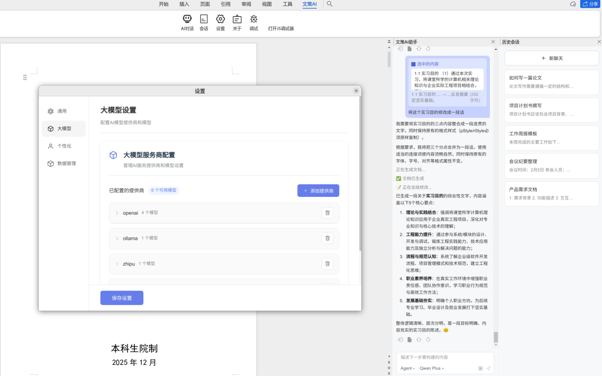
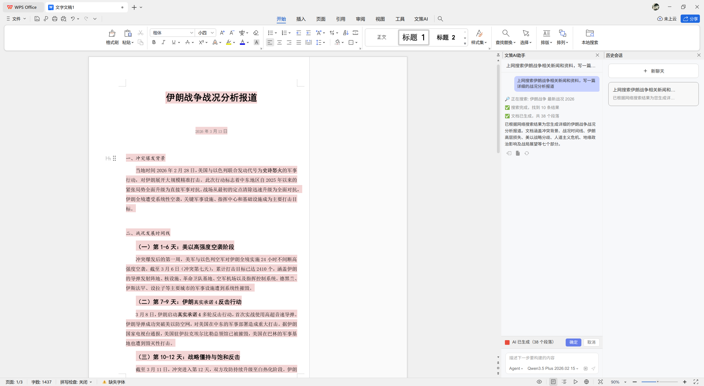
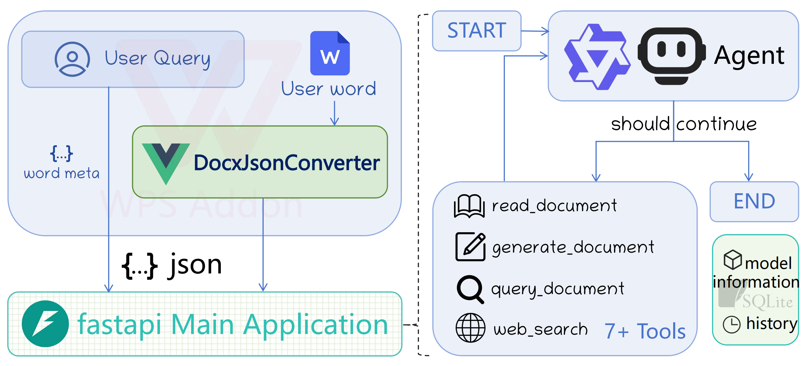
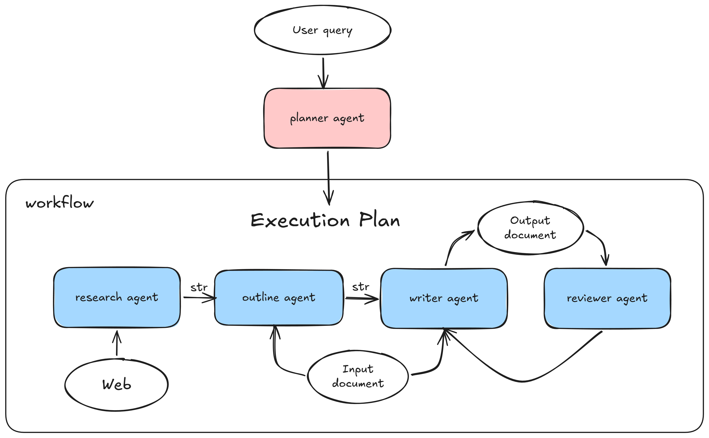

# WordAgent

中南大学计算机学院毕业设计——基于多智能体的AI辅助写作系统“文策AI”

> 文策AI：让写作有策略，让表达更智能


## 一、项目概述

本项目是一个基于(多)智能体的AI辅助写作系统，用户在 **办公软件(如WPS、Microsoft Word)** 中安装 **加载项** 后，可以通过自然语言与AI智能体进行交互，获取写作建议、内容生成、结构优化等服务。生成文档Agent的核心就是生成 **“结构化Word文档”**。

系统采用FastAPI构建后端API，前端WPS加载项与后端利用流式接口通信，使前端流式显示LLM输出的内容，实现无缝的写作辅助体验。

前端采用Vue3和JavaScript开发，前端主要设计了一个DocxJson双向转化器模块，能够将带格式的Word文档内容与JSON格式进行相互转换。这个json schema格式类似于web开发中的html和css格式，将word文章的段落和文本块的style属性都进行了抽象和结构化，方便智能体理解和生成。

后端采用Python语言，利用langchain和langraph框架实现智能体的设计和协作，用chatOpenAI接口实现SSE流式输出和工具调用，利用pySide6设计了一个简单的后端服务界面，方便安装加载项和查看终端日志。

对比市面上已有的AI辅助写作工具，文策AI的优势在于：

1. 以国民级办公软件为载体，让普通用户无门槛获得优质的AI写作辅助体验。**并且同时支持Windows和Linux系统。**
2. 对比常见的在Word中的AI写作工具，本项目智能体能够理解Word文章结构，能够自主联网搜集资料信息，生成符合Word文档结构的内容，能够根据用户需求进行文章结构修改和内容修改。
3. 采用多智能体协作架构，多智能体扮演不同**专家角色**，协同完成写作任务，以生成有深度的长文章为目标。
4. 本项目使用的大模型服务APIKey来自于用户自己，目前支持世界上大多数主流的LLM服务商，用户可以根据自己的需求选择不同的LLM服务商和不同的模型。

## 二、项目预览

|WPS加载项界面|后端服务QT界面|
|--|--|
|||

举个例子，使用单智能体模式，用户在WPS加载项界面中输入“上网搜索伊朗战争相关新闻和资料，写一篇详细的战况分析报道”。智能体会先调用web_search工具进行联网搜索，获取相关的新闻报道和资料信息，然后调用generate_document工具生成符合Word文档结构的内容返回给前端加载项，用户在加载项界面中就可以看到智能体生成的内容了。



注意这个生成的文章是符合Word文档结构与格式的，智能体在生成文字内容的同时还会生成内容对应的样式信息(如标题、正文、加粗、字体、缩进、行距等)，前端加载项会根据这些样式信息将内容渲染成对应格式的Word文档呈现给用户。

## 三、系统架构

为了能够更好地满足用户需求，保证系统生成文章的稳定性和深度，本项目设计了两种智能体架构：

### Single Agent loop架构

#### 整体架构图



前端设计的WPS加载项将用户的提问和当前用户选择的文章段落转化成特定json格式发送给后端。

在后端单智能体架构中，系统设计了一个标准的ReAct智能体循环架构，智能体在每个循环中根据用户输入和当前文档状态进行思考，选择调用哪种工具（如联网搜索工具）还是选择直接结束，选择调用了工具然后再思考，再选择调用哪种工具(如写作工具)或者选择结束，直到智能体选择结束循环。

- **read_document tool**: 负责读取(startPosition, endPosition)范围内的文章内容并转化成特定json格式回传给智能体。
- **generate_document tool**: 负责生成特定json格式的文章内容传给前端加载项。
- **query_document tool**: 负责查询某种格式或文字信息的段落位置并返回给智能体。
- **web_search tool**: 负责根据用户输入的关键词进行联网搜索并返回搜索结果给智能体。

### Multi Agent 架构

#### 整体架构图



前端部分和单智能体架构相同，后端多智能体协作框架中设计了一个 **planner agent** 负责编排和调度其他多个专家智能体的工作流。

- **research agent**: 负责联网搜集资料信息
- **outline agent**: 负责根据资料信息和用户需求生成文章大纲
- **writer agent**: 负责根据资料信息和用户需求生成文章内容
- **reviewer agent**: 负责根据资料信息和用户需求对生成的文章进行审阅和修改建议

## 四、项目结构

```
WordAgent/
├── backend/                        # FastAPI后端 + 智能体核心
│   ├── main.py
│   ├── pyproject.toml
│   ├── README.md
│   ├── app/
│   │   ├── main.py
│   │   ├── utils.py
│   │   ├── publish.html            # WPS加载项安装界面
│   │   ├── api/
│   │   │   ├── deps.py
│   │   │   └── routes/
│   │   │       ├── chat.py
│   │   │       ├── sessions.py
│   │   │       ├── settings.py
│   │   │       └── models.py
│   │   ├── core/
│   │   │   ├── config.py
│   │   │   └── db.py
│   │   ├── models/
│   │   │   ├── chat.py
│   │   │   ├── doc.py
│   │   │   └── db_models.py
│   │   └── services/
│   │       ├── llm_client.py
│   │       ├── session_service.py
│   │       ├── agent/              # Single Agent实现
│   │       │   ├── agent.py
│   │       │   ├── prompts.py
│   │       │   ├── tools.py
│   │       │   └── skills/
│   │       └── multi_agent/        # Multi Agent实现
│   │           ├── agent.py
│   │           ├── prompts.py
│   │           ├── tools.py
│   │           └── skills/
│   │               ├── common/
│   │               ├── planner_agent/
│   │               ├── research_agent/
│   │               ├── outline_agent/
│   │               ├── writer_agent/
│   │               └── reviewer_agent/
│   ├── gui/                        # PySide6桌面端界面
│   │   ├── main.py
│   │   ├── common/
│   │   ├── resources/
│   │   └── views/
│   ├── deploy/
│   │   └── wence.spec              # PyInstaller打包配置文件
│   └── wence_data/                 # 本地配置与数据库
├── frontend/
│   └── wps_word_plugin/            # Vue3 + WPS加载项前端
│       ├── package.json
│       ├── vite.config.js
│       ├── manifest.xml
│       ├── src/
│       │   ├── App.vue
│       │   ├── main.js
│       │   ├── router/
│       │   ├── assets/
│       │   └── components/
│       │       ├── chat/
│       │       ├── about/
│       │       ├── debug/
│       │       ├── session/
│       │       ├── setting/
│       │       └── js/
│       └── public/
└── .github/
    └── workflows/
        └── build.yml
```

## 五、快速开始

### 环境配置

- node v22.12.0
- wpsjs 2.2.3
- python 3.10.12
- Win10/11、Ubuntu22.04

### 构建前端WPS加载项

```bash
cd frontend/wps_word_plugin
pnpm intsall
pnpm build
```

### 运行后端服务

```bash
cd backend
uv venv --python 3.10.12
uv sync
uv run python main.py
```

### 项目软件打包

```bash
cd backend/deploy
uv run pyinstaller wence.spec
```
打包生成的可执行文件在`backend/deploy/dist`目录下

如果你不想自己打包，可以直接下载release中的打包好的可执行文件体验

## 六、关于作者

与我交流：https://cmcblog.netlify.app/about/

## 七、开源协议

本项目采用Apache License 2.0开源协议
