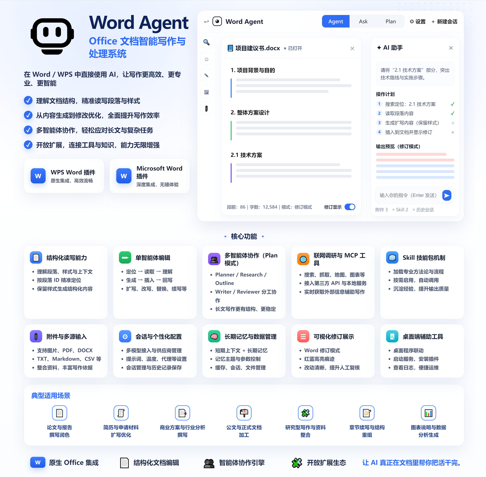
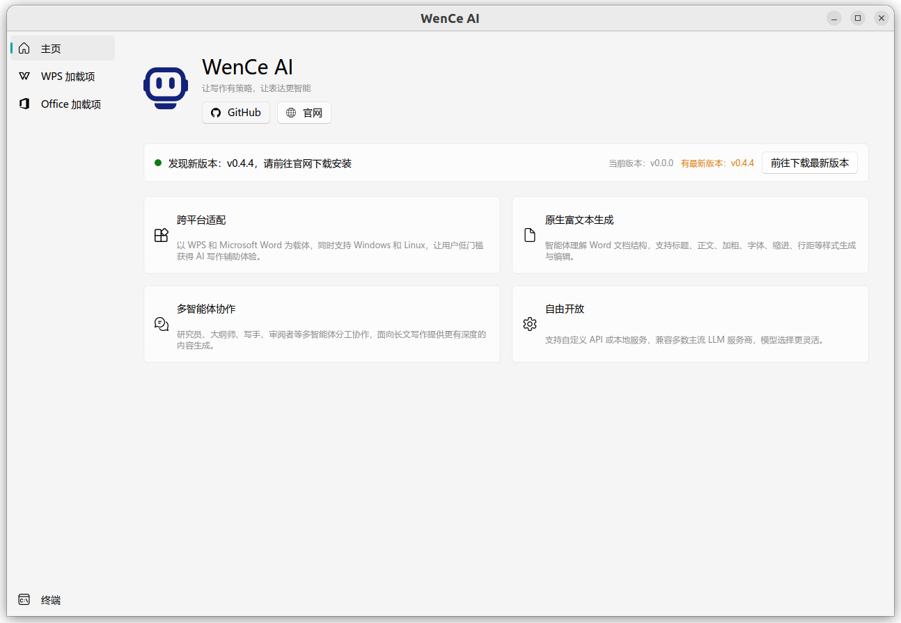

# Word Agent


<p align="center">
  <a href="backend/pyproject.toml"></a>
  <a href="backend/README.md"></a>
  <a href="https://www.langchain.com/"></a>
  <a href="https://www.langchain.com/langgraph"></a>
  <a href="frontend/microsoft_word_plugin/package.json"></a>
  <a href="https://github.com/visresearch/WordAgent/releases"></a>
  <a href="LICENSE"></a>
</p>

<p align="center">
  English | <a href="README.zh-CN.md">中文文档</a>
</p>



## 1. Project Overview

This project is an AI-assisted writing system based on (multi-)agent workflows: **WenCe AI**. After installing the **add-in** in office software such as **WPS or Microsoft Word**, users can interact with AI agents through natural language to get **writing suggestions**, **content generation**, **structure optimization**, and more.

> WenCe AI (Word Agent): strategy-driven writing, smarter expression

Compared with existing AI writing assistants on the market, WenCe AI provides:

1. **Multi-version and cross-platform support**: built on widely used office software with a Copilot-style Word add-in, allowing general users to access high-quality AI writing assistance with a low barrier. It supports both Windows and Linux.
2. **Native rich text with document styles and paragraph editing**: compared with common AI writing tools in Word, this project allows agents to understand Word document structure, autonomously collect online information, generate content that fits Word document structure, and modify article structure and content according to user needs.
3. **Efficient editing with multi-agent collaboration**: multiple agents act as different **expert roles** and collaborate to generate in-depth long-form articles.
4. **Open and flexible, with custom API or local service support**: the LLM API key used by this project is provided by the user. It currently supports most mainstream LLM providers, allowing users to choose different providers and models according to their needs.

## 2. Project Preview

| WPS Add-in UI | Backend QT UI |
| -- | -- |
|  |  |

For example, in WPS **Single Agent** mode, a user can enter: "Expand my internship objective into five points." The agent completes the task through the "**locate -> read -> understand -> edit**" workflow: it first calls `search_document` to locate the target paragraph, then calls `read_document` to read the paragraph content. After analysis and understanding, it calls `delete_document` to remove the original content, and finally calls `generate_document` to generate the expanded result. The frontend add-in renders the before/after content with different colored annotations, making changes easy to review.


> Note: the generated result includes not only text content, but also matching style information such as heading/body style, bold text, font, indentation, and line spacing. The frontend add-in renders the final result according to these styles so that it matches the Word document structure and format.

As another example, in **Multi Agent** mode, the user can ask the system to write a long novel and create illustrations. Different expert agents work in sequence: the `planner agent` orchestrates the agent workflow, the `research agent` searches online novels and calls text-to-image tools, the `outline agent` describes the novel outline, the `writer agent` outputs the article, and finally the `reviewer agent` reviews the paragraphs and provides revision suggestions.


> Note: Multi Agent mode is better at generating long-form content while staying on topic and maintaining coherence, but its tool-calling capability is slightly weaker than Single Agent mode.

In addition, this project supports two types of pluggable extensions for custom tools: **MCP Server** and **Skill**.

1) **MCP Server example (third-party API/service integration)**: users can configure MCP servers so that agents can call third-party APIs like built-in tools. For example, with **Amap MCP** and a **visualization chart MCP Server**, when a user enters "Query Changsha's weather for the next five days, draw a temperature line chart, and write a weather forecast article," the agent first calls Amap MCP to obtain five-day temperature data, then calls the visualization chart MCP Server to generate a line-chart image URL and render the image in the add-in interface.


2) **Skill example (capability packaging and reuse)**: Skill is like packaging a reusable capability and workflow, such as prompt templates, tool-call orchestration, or domain-specific writing/processing logic, into a "skill package." After loading, the agent can select and execute the corresponding Skill according to the task requirements, completing specific task types through a more stable path.


## 3. Development Plan

- [x] Single Agent mode
- [x] Multi Agent mode
- [x] Remote MCP server tool integration
- [x] Local MCP server and Skill tool integration
- [x] Context compression
- [x] Complex style editing for tables, illustrations, equations, etc. (equations are readable but cannot be generated)

#### Supported Office Software

- WPS Office (Windows, Linux), version 12.1.2.24722 and above
- Microsoft Word (Windows, Web), version 2019/2021 and above

## 4. System Architecture

To better meet user needs and ensure the stability and depth of generated articles, this project designs two agent architectures:

### Single Agent Loop Architecture

#### Overall Architecture Diagram


The frontend WPS add-in converts the user's question and the currently selected document paragraphs into a specific JSON format and sends it to the backend.

In the backend Single Agent architecture, the system uses a standard ReAct agent loop. In each loop, the agent reasons based on the user input and current document state, decides whether to call a tool such as a web search tool or finish directly, then continues reasoning after tool calls and chooses another tool such as a writing tool or finishes, until the agent decides to end the loop.

- **read_document tool**: reads article content in the `(startParaIndex, endParaIndex)` range and converts it into a specific JSON format to return to the agent.
- **generate_document tool**: generates article content in a specific JSON format and sends it to the frontend add-in.
- **search_document tool**: searches paragraph positions by format or text information and returns them to the agent.
- **delete_document tool**: deletes corresponding content according to paragraph IDs.

### Multi Agent Architecture

#### Overall Architecture Diagram


The frontend part is the same as the Single Agent architecture. In the backend multi-agent collaboration framework, a **planner agent** is designed to orchestrate and schedule the workflow of multiple expert agents.

- **research agent**: collects online reference information
- **outline agent**: generates an article outline based on reference information and user requirements
- **writer agent**: generates article content based on reference information and user requirements
- **reviewer agent**: reviews generated articles and provides revision suggestions according to reference information and user requirements

## 5. Quick Start

### Environment Setup

- node v22.12.0
- wpsjs 2.2.3
- python 3.11.14
- Windows 10/11, Ubuntu 22.04

### Build Frontend Add-in

```bash
cd frontend/wps_word_plugin       # WPS Word add-in
cd frontend/microsoft_word_plugin # Or Microsoft Word add-in
pnpm install
pnpm build
```

### Run Backend Service

```bash
cd backend
uv run python main.py
```

### Use LangSmith Tracing

This project also supports LangSmith for tracing and analyzing agent behavior. For configuration, see the instructions in the [backend README](backend/README.md).


### Package the Software

```bash
cd backend/deploy
uv run pyinstaller wence.spec
```

The packaged executable is generated in the `backend/deploy/dist` directory.

If you do not want to package it yourself, you can directly download the packaged archive from the release, extract it, and run the executable.

### Software Download

Packaged release files are available in [Release](https://github.com/visresearch/WordAgent/releases).

### Run the Software

After downloading, double-click the executable to start the backend service (`wence_word_plugin -> Install`), open Word, trust the add-in, and start using the service.

You need to configure an LLM API. This project currently uses the Qwen 3.6 Plus series API service from Alibaba Cloud Bailian.

## 6. LLM API Compatibility

This project has tested some LLM APIs and will continue testing and adapting more APIs. Current status:

- [x] Qwen 3.6 Plus runs stably
- [x] GLM-5.1 runs stably
- [x] GPT 5.4 runs stably
- [x] MiniMax M2.5 runs stably
- [x] Step 3.5 Flash runs stably
- [x] DeepSeek v4 pro runs stably
- [x] Claude Sonnet/Opus runs stably
- [x] MiMo-V2.5 runs stably
- [ ] Gemini 3.1 Pro

> GPT series models are recommended for the best results, followed by Qwen series models. See the [evaluation document](./backend/evaluation/README.md) for details.

Note: this project used some free quotas from [Alibaba Cloud Bailian](https://bailian.console.aliyun.com/) and [OpenRouter](https://openrouter.ai/models?q=free) during development.

## 7. About

Contact: https://visresearch.github.io/WordAgent/guide/about.html

## 8. License

Apache License 2.0.
