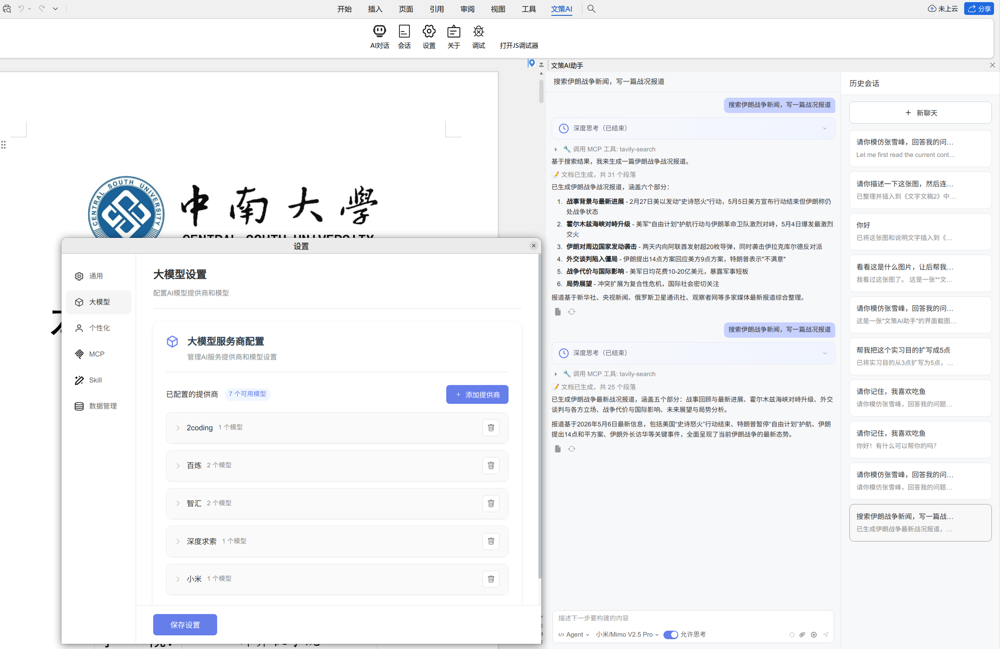
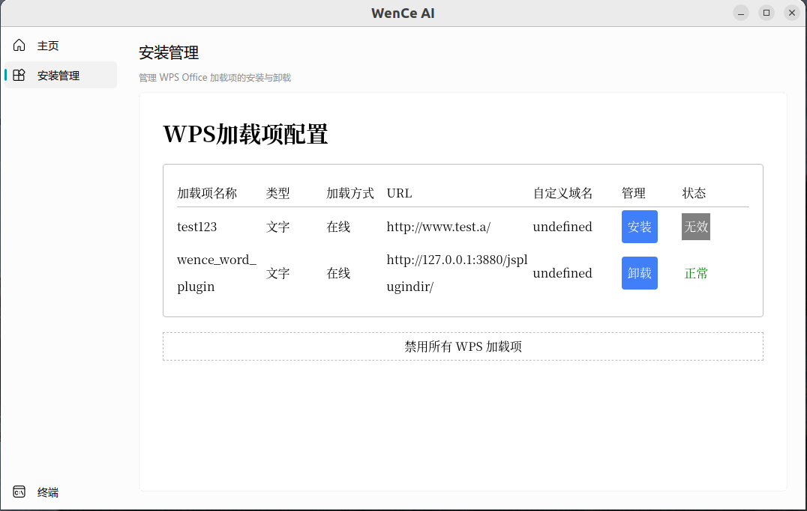
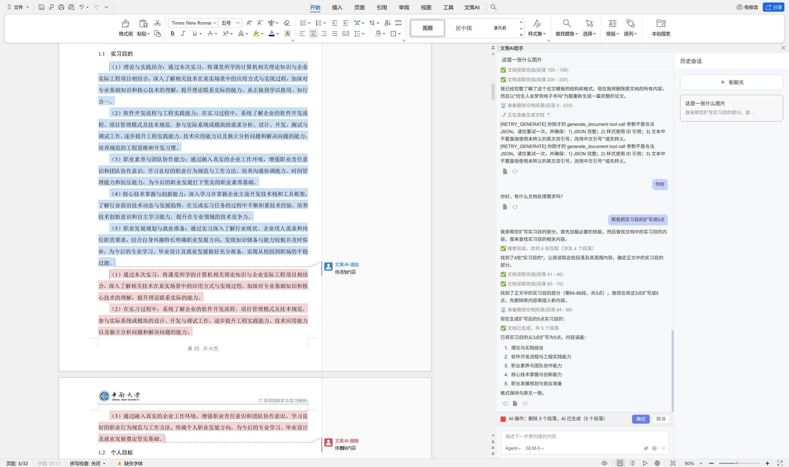
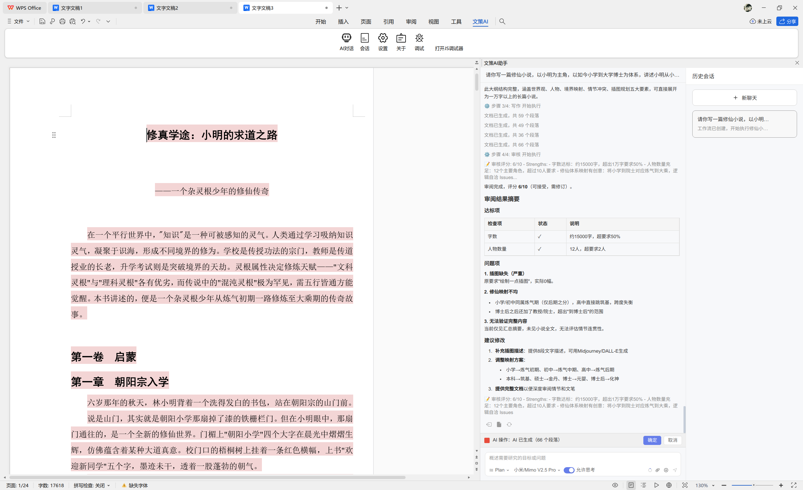
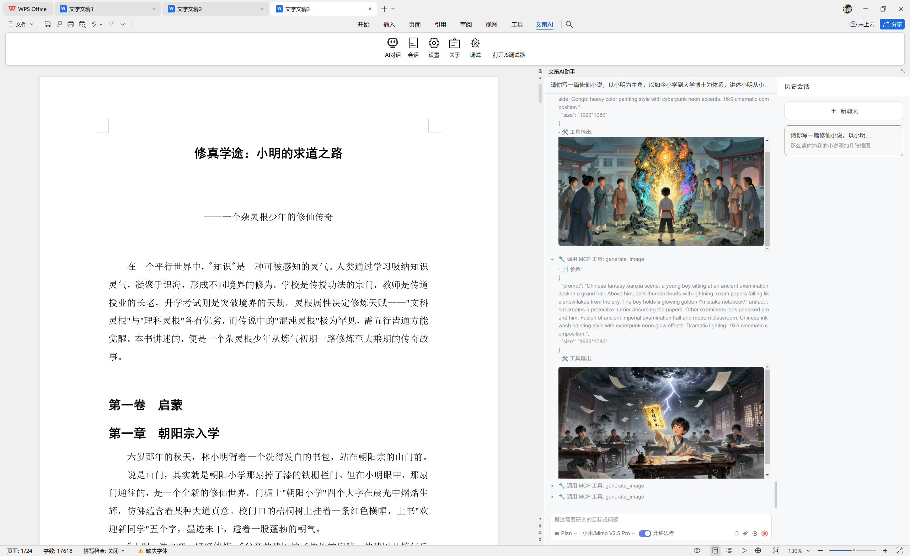
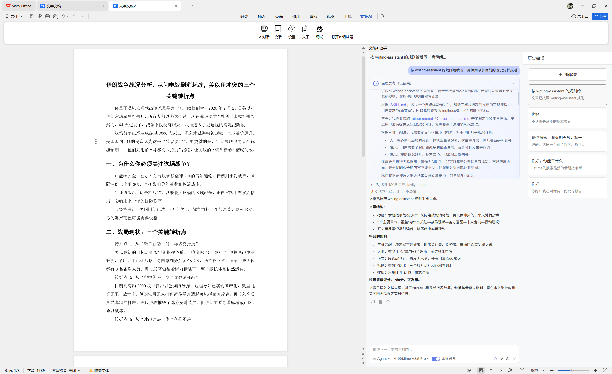
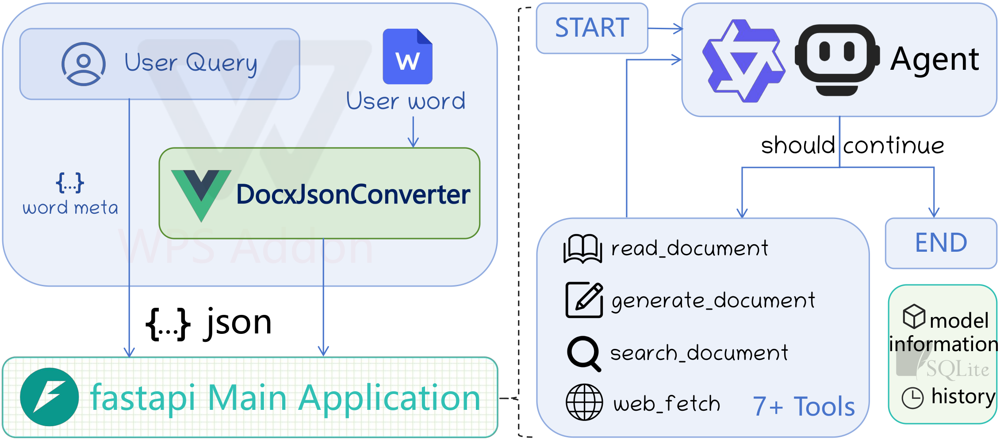
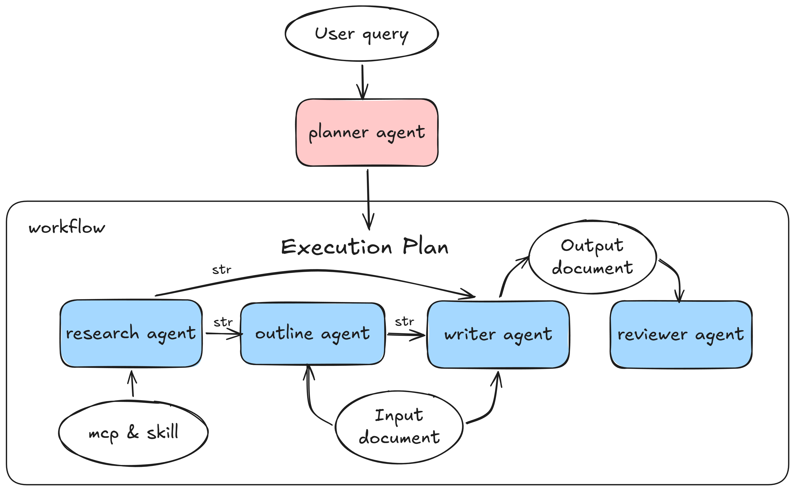

# Word Agent


<p align="center">
  <a href="backend/pyproject.toml"></a>
  <a href="backend/README.md"></a>
  <a href="https://www.langchain.com/"></a>
  <a href="https://www.langchain.com/langgraph"></a>
  <a href="frontend/microsoft_word_plugin/package.json"></a>
  <a href="README.md"></a>
  <a href="LICENSE"></a>
</p>

<p align="center">
  <a href="README.md">English</a> | 中文文档
</p>

## 一、项目概述

本项目是一个基于(多)智能体的AI辅助写作系统：文策AI，用户在 **办公软件(如WPS、Microsoft Word)** 中安装 **加载项** 后，可以通过自然语言与AI智能体进行交互，获取**写作建议**、**内容生成**、**结构优化**等服务。

> 文策AI（Word Agent）：让写作有策略，让表达更智能

本项目采用FastAPI构建后端API，前端WPS加载项与后端利用流式接口通信，使前端流式显示LLM输出的内容，实现无缝的写作辅助体验。

前端采用Vue3和JavaScript开发，前端主要设计了一个DocxJson双向转化器模块，能够将带格式的Word文档内容与JSON格式进行相互转换。

后端采用Python语言，利用langchain和langraph框架实现智能体的设计和协作，用chatOpenAI接口实现SSE流式输出和工具调用，利用pySide6设计了一个简单的后端服务界面，方便安装加载项和查看终端日志。

不难看出，**生成结构化Word文档**是本项目的核心。项目中定义json schema格式类似于web开发中的html和css格式，将word文章的段落和文本块的style属性都进行了抽象和结构化，方便智能体理解和生成。json主要的数据结构具体为：

- **paragraphs**: word文档段落数组，包含多个run文本块，paragraphs是agent主要修改的对象
  - **pStyle**: 段落样式ID（如标题1、标题2、正文等）
  - **runs**: 文本块数组，本项目中定义的文档的最小单位
    - **text**: 文本内容
    - **rStyle**: 字符样式ID（如加粗、红色等）
  - **paraIndex**: 段落索引，智能体可以根据这个索引定位到文档中的具体段落进行修改
- **styles**: 样式定义字典，包含所有段落样式和字符样式的定义，智能体生成文档时需要引用这些样式ID来保证文档格式正确

对比市面上已有的AI辅助写作工具，文策AI的优势在于：

1. **支持多版本、跨平台适配**：以国民级办公软件为载体，类Copilot风格Word加载项，让普通用户无门槛获得优质的AI写作辅助体验，并且同时支持Windows和Linux系统。
2. **原生富文本，支持文档样式、段落编辑**：对比常见的在Word中的AI写作工具，本项目智能体能够理解Word文章结构，能够自主联网搜集资料信息，生成符合Word文档结构的内容，能够根据用户需求进行文章结构修改和内容修改。
3. **高效编辑，支持多智能体协作架构**：多智能体扮演不同**专家角色**，以生成有深度的长文章为目标，协同完成写作任务。
4. **自由开放，支持自定义API或本地服务**：本项目使用的大模型服务APIKey来自于用户自己，目前支持世界上大多数主流的LLM服务商，用户可以根据自己的需求选择不同的LLM服务商和不同的模型。

## 二、项目预览

|WPS加载项界面|后端服务QT界面|
|--|--|
|||

举个例子，以 WPS 的**单智能体（Single Agent）模式**为例：用户在加载项里输入“帮我把实习目的扩写成 5 点”。智能体会按“**定位 → 读取 → 理解 → 编辑**”的流程完成任务：先调用 `search_document` 定位目标段落，再调用 `read_document` 读取段落内容；在分析理解后，调用 `delete_document` 删除原内容，最后调用 `generate_document` 生成新的扩写结果。前端加载项会以不同颜色的批注方式渲染修改前/修改后内容，便于用户直观看到变更。



> 注意：生成结果不仅包含文字内容，还包含与之匹配的样式信息（如标题/正文、加粗、字体、缩进、行距等）。前端加载项会依据这些样式信息将内容渲染为符合 Word 文档结构与格式的最终效果。

再举个例子，改为 **多智能体（Multi Agent）模式**，用户提问写一篇长篇小说并绘制插图。各个专家智能体会依次工作，从`规划智能体`编排智能体流程，到`研究智能体`搜索网文小说，调用文生图，到`大纲智能体`描述小说大纲，到`写作智能体`输出文章，最后`检查智能体`回顾文章段落，提出修改意见。





> 注意：多智能体模式比单智能体更容易生成长文，同时还能够不跑题以及首尾呼应，但是工具调用能力略差于单智能体

除此之外，本项目还支持两类“可插拔扩展”来接入自定义工具：**MCP Server** 与 **Skill**。

1）**MCP Server 示例（第三方 API / 服务接入）**：用户可以通过配置 MCP 服务器，让智能体像调用内置工具一样调用第三方 API 来增强能力。以 **高德地图 MCP** 和 **可视化图表 MCP Server** 为例：当用户输入“查询长沙未来五天的天气，绘制一个气温折线统计图，并写一份天气预报文章”时，智能体会先调用高德地图 MCP 获取未来五天的气温数据，再调用可视化图表 MCP Server 生成折线图图片 URL，并将图片渲染在加载项界面中。


2）**Skill 示例（能力打包与复用）**：Skill 更像是把一套可复用的能力与流程（例如提示词模板、工具调用编排、特定领域写作/处理逻辑等）封装成“技能包”。加载后，智能体可以根据任务需求选择并执行对应 Skill，用更稳定的路径完成特定类型任务。



## 三、开发计划

- [x] 支持单智能体模式
- [x] 支持多智能体模式
- [x] 支持远程MCP服务器工具接入
- [x] 支持本地MCP服务器和Skill工具接入
- [x] 支持上下文压缩
- [x] 支持表格、插图、公式等复杂样式编辑(公式可读但是不能生成)

#### 本项目支持的办公软件

- WPS Office（Windows、Linux）版本 12.1.25225及以上
- Microsoft Word（Windows、Web）版本 2019/2021及以上

## 四、系统架构

为了能够更好地满足用户需求，保证系统生成文章的稳定性和深度，本项目设计了两种智能体架构：

### Single Agent loop架构

#### 整体架构图



前端设计的WPS加载项将用户的提问和当前用户选择的文章段落转化成特定json格式发送给后端。

在后端单智能体架构中，系统设计了一个标准的ReAct智能体循环架构，智能体在每个循环中根据用户输入和当前文档状态进行思考，选择调用哪种工具（如联网搜索工具）还是选择直接结束，选择调用了工具然后再思考，再选择调用哪种工具(如写作工具)或者选择结束，直到智能体选择结束循环。

- **read_document tool**: 负责读取(startPosition, endPosition)范围内的文章内容并转化成特定json格式回传给智能体。
- **generate_document tool**: 负责生成特定json格式的文章内容传给前端加载项。
- **search_document tool**: 负责查询某种格式或文字信息的段落位置并返回给智能体。
- **web_fetch tool**: 负责根据用户输入的网站链接进行抓取获取信息。

### Multi Agent 架构

#### 整体架构图



前端部分和单智能体架构相同，后端多智能体协作框架中设计了一个 **planner agent** 负责编排和调度其他多个专家智能体的工作流。

- **research agent**: 负责联网搜集资料信息
- **outline agent**: 负责根据资料信息和用户需求生成文章大纲
- **writer agent**: 负责根据资料信息和用户需求生成文章内容
- **reviewer agent**: 负责根据资料信息和用户需求对生成的文章进行审阅和修改建议

## 五、快速开始

### 环境配置

- node v22.12.0
- wpsjs 2.2.3
- python 3.11.14
- Win10/11、Ubuntu22.04

### 构建前端加载项

```bash
cd frontend/wps_word_plugin       # WPS Word加载项
cd frontend/microsoft_word_plugin # 或Microsoft Word加载项
pnpm intsall
pnpm build
```

### 运行后端服务

```bash
cd backend
uv run python main.py
```

### 使用Langsmith跟踪

另外，本项目还支持使用Langsmith进行智能体行为跟踪和分析，配置方法参考[后端README](backend/README.md)中的说明。


### 项目软件打包

```bash
cd backend/deploy
uv run pyinstaller wence.spec
```
打包生成的可执行文件在`backend/deploy/dist`目录下

如果你不想自己打包，可以直接下载release中打包的压缩包，解压后点击exe文件即可使用。

### 软件下载

打包后的发行版文件详见[Release](https://github.com/visresearch/WordAgent/releases).

### 软件运行

下载后双击exe文件，启动后端服务（wence_word_plugin->安装），打开Word软件，信任加载项，即可体验服务。

需要配置LLM API，本项目目前使用的是阿里云百炼平台的qwen3.6-plus系列API服务。

## 六、LLM API适配情况

本项目对部分LLM API进行了测试，后续陆续测试适配中，具体情况如下：

- [x] Qwen 3.6 Plus运行稳定
- [x] GLM-5.1运行稳定
- [x] GPT 5.4运行稳定
- [x] MiniMax M2.5运行稳定
- [x] Step 3.5 Flash运行稳定
- [x] DeepSeek v4 pro运行稳定
- [x] Claude Sonnet/Opus 运行稳定
- [x] MiMo-V2.5 运行稳定
- [ ] Gemini 3.1 Pro

> 推荐使用 **GPT系列** 模型，效果最好，其次是 **Qwen系列** 模型，详情请看[测评文档](./backend/evaluation/README.md)

注：本项目开发使用了部分[阿里云百炼](https://bailian.console.aliyun.com/)、[Openrouter](https://openrouter.ai/models?q=free)免费额度

## 七、关于

与我交流：https://visresearch.github.io/WordAgent/guide/about.html

## 八、开源协议

本项目采用Apache License 2.0开源协议