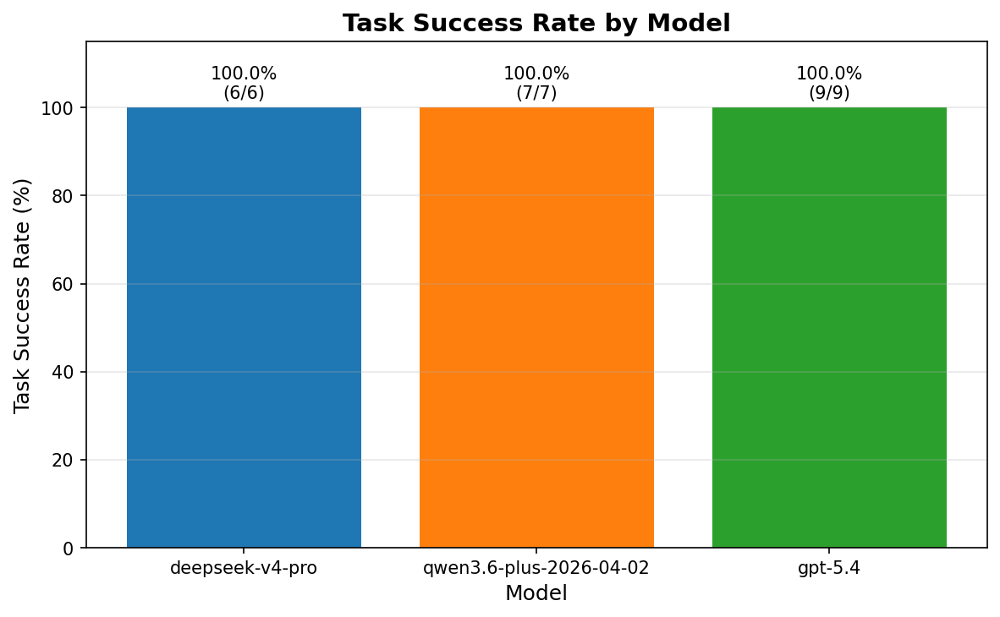
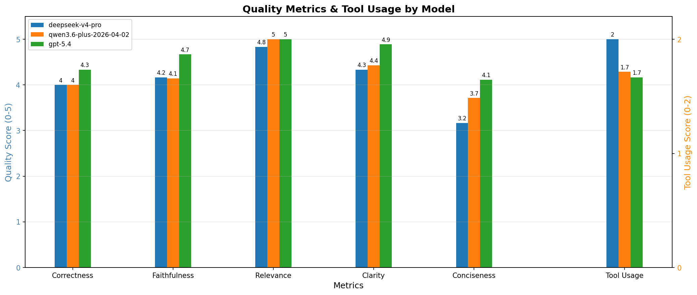
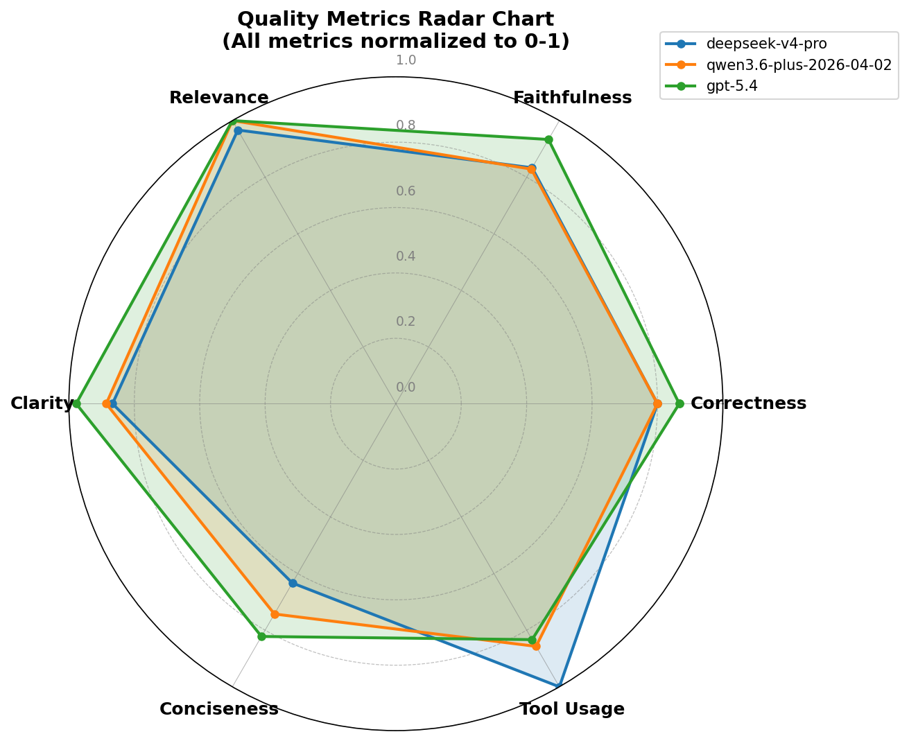

# 评估模块

评估 Agent 执行结果的模块，通过 LLM 评判生成轨迹的质量。

## 评估指标效果

### 任务完成率指标



### 各项质量指标

| 柱状图 | 雷达图 |
|---|---|
|  |  |

## 环境配置

在 `backend/.env` 中配置评估所需的 API：

```bash
# 评估用 API（可与主服务不同）
EVAL_OPENAI_API_KEY=your_api_key
EVAL_OPENAI_BASE_URL=https://api.openai.com/v1
EVAL_OPENAI_MODEL=gpt-4o

# 并发数量（默认 5）
EVAL_CONCURRENCY=5

# LangSmith 数据集配置
LANGSMITH_DATASET_NAME=WordAgent_test
```

## 数据集格式

实现 `DatasetFetcher` 接口，将评估数据转换为以下格式：

| 字段 | 类型 | 说明 |
|------|------|------|
| id | str | 数据唯一标识 |
| user_request | str | 用户请求 |
| agent_trace | str | Agent 执行轨迹（包含工具调用） |
| model_name | str | 模型名称 |

参考 `dataset.py` 中的示例实现。

## 运行评估

```bash
cd backend
uv run python -m evaluation.run
```

评估结果输出到 `evaluation/outputs/{timestamp}/` 目录：
- `results.csv`: 所有评估结果
- `summary.csv`: 汇总统计
- `task_success.png`: 任务完成率柱状图
- `quality_metrics.png`: 质量指标柱状图（含 tool_usage）
- `radar_chart.png`: 质量指标雷达图

## 评估指标

### 一级指标

| 指标 | 范围 | 说明 |
|------|------|------|
| Task Success | 0-1 | 是否成功完成用户请求 |

### 核心质量

| 指标 | 范围 | 说明 |
|------|------|------|
| Correctness | 0-5 | 内容正确性（无事实错误、语法正确） |
| Faithfulness | 0-5 | 忠诚度（是否遵循指令、正确使用工具结果） |
| Relevance | 0-5 | 相关性（是否切题、不跑题） |

### 表达质量

| 指标 | 范围 | 说明 |
|------|------|------|
| Clarity | 0-5 | 清晰度（结构清晰、易于理解） |
| Conciseness | 0-5 | 简洁性（无冗余、高效表达） |

### Agent 能力

| 指标 | 范围 | 说明 |
|------|------|------|
| Tool Usage | 0-2 | 工具使用合理性 |

评估 Prompt 模板见 `evaluator_prompt.md`，通过 `{input}` 和 `{output}` 占位符注入数据。
